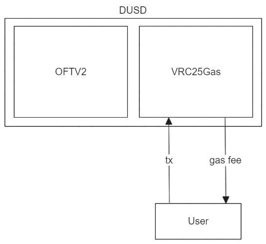
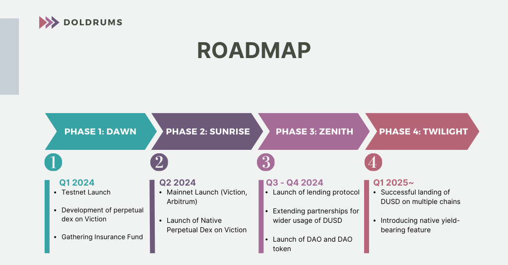

## Doldrums Protocol

Doldrums is a protocol for issuing a Delta-Neutral Stablecoin. It integrates with various features like native Zero Gas transactions at Viction, supports a wider range of assets, and solves the problem of liquidity fragmentation.

### Main Features

- **Delta-Neutral Hedging**: Maintains a delta-neutral position by hedging the underlying asset on perpetual DEX.
- **Multi-Chain Support**: Uses Layer Zero(OFT V2) as a multi-chain framework, supports Viction Chain and Arbitrum.
- **Gasless VRC-25**: DUSD implements VRC-25 to support gasless transactions.

### Contracts Architecture

### Contract Addresses

|  Contract Name  	|               Viction Address              	|                Fuji Address                	|
|:---------------:	|:------------------------------------------:	|:------------------------------------------:	|
|    Controller   	| 0x31C6d1884E408B63A910eF547afdA1180d919e13 	|                                            	|
|       DUSD      	| 0x46F96fB34Ac52DaE43E7FC441F429d2F5BcCDf52 	| 0xf40E719D4F215712D9DC9a0568791E408c71760F 	|
| DoldrumsGateway 	| 0x6b5749854cF3d44688baa009bb419b82EFcD3a17 	|                                            	|
|  PerpDexGateway 	|                                            	| 0xdb3975365f1c8258758D4D55687F659d58B74F13 	|
|    Mock WVIC    	| 0x24c470BF5Fd6894BC935d7A4c0Aa65f6Ad8E3D5a 	|                                            	|
|    Mock WETH    	| 0xA5f8B90975C6f3b15c90CbC75b44F10300b42bbe 	|                                            	|
|     Mock DAI    	| 0xEC3Ac809B27da7cdFC306792DA72aA896ed865eD 	|                                            	|
|   Mock PerpDex  	|                                            	| 0xf8efeBAec7C3a37106e14a8d4994Db730dDbC08F 	|

### Roadmap

### Whitepaper

Please refer to the [whitepaper](./docs/Doldrums_whitepaper.pdf) for more details.

### Team Members

- Sangwon Moon
- Seungmin Jeon
- Wonjae Choi
  - Email: choi@wonj.me
  - Github: [@wonj1012](www.github.com/wonj1012)
  - LinkedIn: [Wonjae Choi](https://www.linkedin.com/in/wonj/)
  - Homepage: [wonj.me](https://wonj.me)
