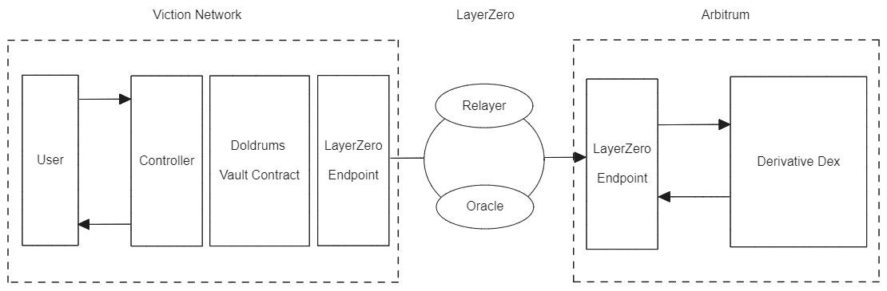

## Doldrums Protocol

Doldrums is a protocol for issuing a Delta-Neutral Stablecoin. It integrates with various features like native Zero Gas transactions at Viction, supports a wider range of assets, and solves the problem of liquidity fragmentation.

### Main Features

- **Delta-Neutral Hedging**: Maintains a delta-neutral position by hedging the underlying asset on perpetual DEX.
- **Multi-Chain Support**: Uses Layer Zero(OFT V2) as a multi-chain framework, supports Viction Chain and Arbitrum.
- **Gasless VRC-25**: DUSD implements VRC-25 to support gasless transactions.

### Contracts Architecture

### Contract Addresses

| Contract Name | Viction Chain Address | Arbitrum Address |
| :------------ | :-------------------: | :--------------: |
| a             |                       |                  |

### Whitepaper

Please refer to the [whitepaper](./docs/Doldrums_whitepaper.pdf) for more details.

### Team Members

- Sangwon Moon
- Seungmin Jeon
- Wonjae Choi
  - Email: choi@wonj.me
  - Github: [@wonj1012](www.github.com/wonj1012)
  - LinkedIn: [Wonjae Choi](https://www.linkedin.com/in/wonj/)
  - Homepage: [wonj.me](https://wonj.me)
